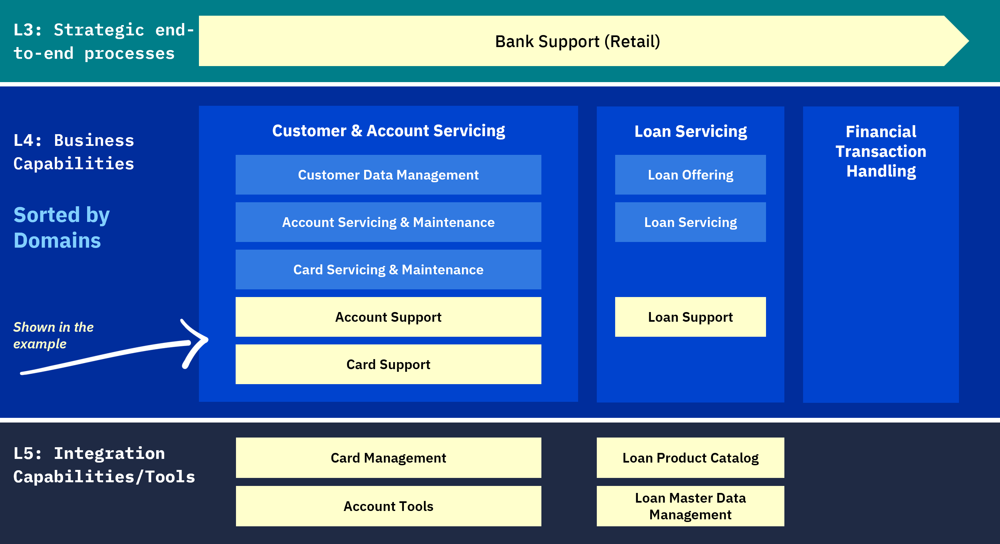
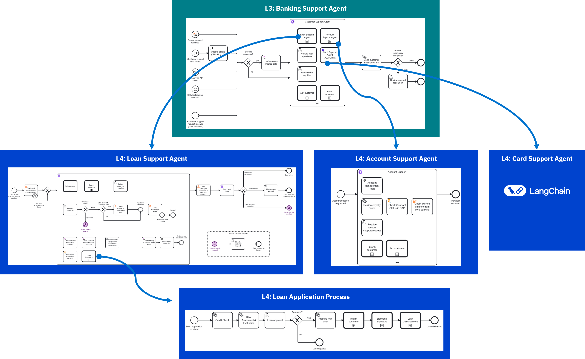

# Bank Support Agent Demo

A comprehensive demonstration of agentic BPMN and multi-agent collaboration built for CamundaCon NYC 2025. This demo showcases how modern process orchestration can integrate AI agents across multiple business capabilities to deliver intelligent, automated customer support.

## What is it?

This demo implements a bank support system that demonstrates:

- **Agentic BPMN** - BPMN processes that can make autonomous decisions using AI
- **Multi-agent collaboration** - Multiple specialized agents working together
- **Omni-channel interaction** - Support across email, chat, and other channels
- **Employee engagement integration** - Human-in-the-loop workflows when needed
- **Long-running agents** - Persistent agent state and memory
- **Agent-to-Agent (A2A) protocol** - Direct communication between agents
- **Model Context Protocol (MCP)** - Tool discovery and integration

## Why is it great?

This architecture demonstrates Enterprise Agentic Automation by combining:

1. **Enterprise-grade orchestration** with Camunda's proven BPMN engine
2. **AI-powered decision making** leveraging LLMs
3. **Seamless integration** between different agent technologies (Camunda, Python/Langchain)
4. **Real-world business scenarios** from banking support operations
5. **Scalable multi-level architecture** following Enterprise Process Orchestration principles

## Business Architecture

The demo follows the levels from [Enterprise Process Orchestration](https://www.amazon.com/Enterprise-Process-Orchestration-Hands-Technology/dp/1394309678/). The yellow highlighted components are implemented in this demo:



### Business Capabilities

**Level 3 - End-to-End Process:**
- **Bank Support Agent**: Main orchestration process ([process model](pics/banking-support-agent.png))

**Level 4 - Business Capabilities:**
- **Account Support Agent**: Account management using MCP tools ([process model](pics/account-support-agent.png))
- **Loan Support Agent**: Loan support with long-term memory and AI judging ([process model](pics/loan-support-agent.png))
- **Card Support Agent**: Python/Langchain agent for card operations (no graphical model)
- **Loan Application Process**: Traditional deterministic BPMN ([process model](pics/loan-application.png))



## Watch it

### Recording from CamundaCon NYC 2025

See [https://www.camundacon.com/event-session/camundacon-new-york-2025/day-2-opening-keynote-building-the-ai-driven-enterprise-with-agentic-orchestration?on_demand=true](Recording).

### Screenshots

Screenshots of the demo run can be found in [Screenshots.pdf](pics/screenshots.pdf).

## How to run yourself

[How to run](HOWTO_RUN.md)

## Data Format

### SupportCase

We have a `supportCase` variable. Example:

```json
{
	"subject": "Help",
	"request": "I need to get my bank details to receive money internationally. My customer id = ACC123456789",
	"originalMessageInFull": "",
	"communicationContext": {
		"channel": "email",
		"channelId": "<UUID of the channel>",
		"emailAddress": "bernd.it.depends.ruecker@gmail.com",
		"conversationId": null
	},
	"customer": {
		"name": "Ruecker",
		"email": "bernd.it.depends.ruecker@gmail.com",
		"firstname": "Bernd",
		"id": 7839451262, // ACC123456789?
		"address": "Hauptstrasse 123, 10115 Berlin, Germany"
	}
}
```

### Other variables

`riskAssesment`

```json
{
  riskClass: "B",
  riskAssesment: "No risks specific discovered, fair customer history, payback realistic",
  approval: true
}
```

`loanApplication`:

```json
{
  customerId: "15",
  lastName: "Ruecker",
  firstName: "Bernd",
  newCustomer: false,
  emailAddress: "bernd.it.depends.ruecker@gmail.com",
  requestedTerm: 36,
  amountRequested: 2000,
  moreData: "..."
}
```

### Communication Interface

Email Interface

Pass `communicationContext` and `communicationContent`:

```JSON
{
    "subject": "RE: " + supportCase.subject,
    "text": fromAi(toolCall.response, "The text response to reply to the customer")
}
```

The response:

```JSON
{
  "status": "success",
  "email": "...",
  "text": "This is what we got"
}
```
